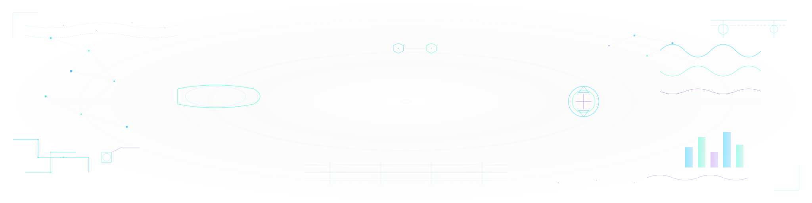

## 👋 Hi there! I'm Emre Yıldırım

### 🎓 About Me
I am an **Industrial Engineering** student at **Istanbul Technical University (ITU)**, focused on **Data Science** and **Machine Learning**. Passionate about leveraging data to drive intelligent decision-making and building impactful solutions.

### 💻 Skills

**Languages:**

**Core Focus:**

### 💼 Experience
- **Intertech Internship**: Gained hands-on experience with **Agile-Scrum** methodologies and contributed to **Chatbot development** projects.

### 📈 GitHub Stats

 

### 📫 Let's Connect

